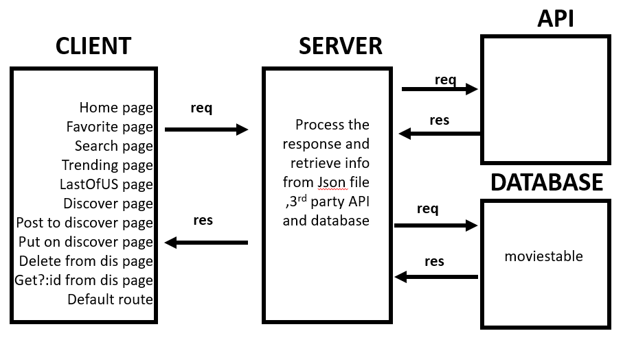

# Movies-Library - V 1.0.0

**Author Name**: Abdulkareem Abunabhan

## WRRC

## Overview

this application is tracking the new movies from all catogries.

## Getting Started

You will a client that can swnd requests from diffrent types like: postman or thunderClient ...

## Project Features

added new routes so you can add and edit on a movie and delete from the list by using id for each movie;

### resource

The Movie Database API : "https://developers.themoviedb.org/"
